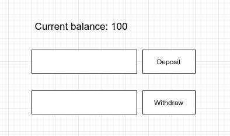

# Lab 1 - Flernivåarkitektur

## Syfte
Syftet med denna lab är att få en återblick i det som gjordes i Java backend 1 samt förstärka kunskaperna i vad flernivåarkitektur är, vad som bör finnas i varje lager, samt ge kunskaper om hur man kan strukturera service/domän-tieret i lager.

## Övergripande målbild
Efter slutförd lab ska det finnas en applikation som där du kan
* Öppna ett bankkonto
* Sätta in pengar på kontot
* Ta ut pengar på kontot

Applikationen ska vara uppdelad i tre nivåer (3 tiers)
* Persentationslager
  * Körs i användarens klient, här vill vi enbart ha presentationslogik, e.g hur något presenteras
* Servicelager
  * Körs i backend servern, här vill vi enbart ha affärslogik
* Datalager
  * Finns i databasen, här vill vi enbart ha logik gällande datat.

## Föreslagna ramverk
* Spring boot (Required)
* Thymeleaf (Optional, du får välja själv hur du vill hosta och köra din frontend)
* Hibernate (Required)
* Mysql (Required)

## Application
Till denna labb finns det ett färdigt startprojekt som ni kan utgå ifrån om ni vill, men det är inget måste och ni kan starta helt från scratch om ni vill.

Om du startar applikationen hittar du dess entry point här: http://localhost:8080/bank/dan/account

## Frontend
GUIt behöver inte vara vackert. Det räcker med att skriva ut nuvarande balans och ha möjlighet att fylla i en summa och välja om den ska sättas in eller tas ut från kontot.
Här kommer en enkel mockup på hur det skulle kunna se ut, men du får förståss designa denna precis som du vill.

Hur klenten pratar med servern är upp till er. Ett förslag är att använda er av MVC mönstret och låta thymeleaf göra det mesta av jobbet.
Ett exempel på hur det görs finns i `BankResource.java`. Ni kan även ta inspiration från de projekt ni gjorde under Java Backend 1 -kursen.

## Service 
Även då detta är ett simpelt exempel så ska vi testa att organisera det utefter lager-arkitekturen.

* API-lagret
Här implementerar vi vårat MVC-mönster, vi tar hand om all validering av input osv. Vi ser även till at all information som skickat tillbaka till klienten är formaterat på rätt sätt.
* Applkationslagret
Här implementerar vi våra use cases. Tex i vårat fall har vi tre stycken. Öppna ett konto, sätta in pengar och ta ut pengar. Vi implementerar inte logiken för det utan tar hand om allt runt om kring. Tex läsa upp saker från databasen, spara saker i databasen och anropa rätt metoder för att få logik utförd.
* Domänlagret
Här lever våra entiteter. Java objekt som implementerar vår affärslogik. Vi kanske har ett som heter Account to implementerar all logik och tar hand om alla affärsregler. Om vi använder verktyg som Hibernate kommer vi även att annotera våra entiteter så hibernate vet hur vi kan spara dem i databasen.
* Persistanslagret
Här tar vi hand om allt kring databasen. Vi översätter våra objekt till rader och kolumner etc. 

## Databasen
I denna kurs kommer vi använda oss utav docker, i de flesta aspekter. Detta kommer även gälla vår databas. 

Ett exempel på hur du kan starta databasen hittar du här nedan:

`docker run --rm -p"3306:3306" --name mysql -e MYSQL_ROOT_PASSWORD=password -e MYSQL_DATABASE=lab1 -d mysql:8.0.26`

För att enkelt komma igång, är det vanligt att konfiguera sitt system att låta hibernate skapa upp lämpliga tabeller utifrån annotationerna i kodbasen.
Detta är dock inget som direkt används i arbetslivet. I denna kurs kommer vi använda oss av databasmigreringar.
Dvs vi specifierar hur vi vill att databasen ser ut och vid varje uppstart så kommer applikationen göra de förändringar som behövs. 
Vi använder ett verktyg som heter flyway.

För att lägga till en migrering, skapa en fil `V1__create_account.sql` med sql att skapa din tabell i foldern `resources/db/migration` då kommer spring plocka upp den och köra den vid uppstart.
Tänk på att migreringarna är immutable, dvs så fort de har körts kan de inte ändras. Vill man tex lägga till en kolumn i efterhand får man skapa en ny migrering tex `V2__add_column_user`.
I den utveklarmiljö går det dock att komma runt detta. 
All metadata kring migreringarna sparas i en tabell som heter `flyway_schema_history` här kan du gå in manuellt och ta bort en migrering. tex
`delete from flyway_schema_history where version="1"`. Då kan du editera och köra om migreringen. Detta fungerar dock aldrig i en produktionsmiljö, men kan vara användbart lokalt. 

Remember to enable flyway! `spring.flyway.enabled=false` -> `spring.flyway.enabled=true` i application.properties.
